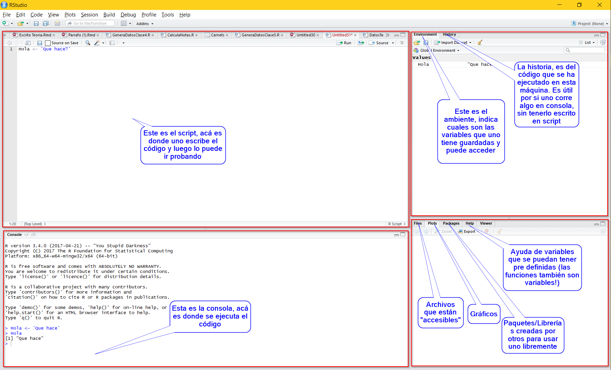

```{r setup, include=FALSE}
knitr::opts_chunk$set(echo = TRUE)
```

## R Studio :) 


\begin{center}
\includegraphics{RStudio-Ball.png} 
\end{center}

<!----Este es un comando de latex----->

## 



## Tipos básicos de objetos en R


* Strings

```{r,tidy = FALSE}
String1 <- 'Los strings van entre comillas simples'
String2 <- "O entre comillas dobles"
String3 <- '4.4' 
```


\pause

* Lógicos

```{r}
Logico1 <- TRUE # También se puede declarar como T
Logico2 <- FALSE # También se puede declarar como F

Logico1 == Logico2
```


## Tipos básicos de objetos en R

\pause

* Enteros
```{r}
Entero1 <- 1L 
Entero2 <- 20000L
Entero3 <- -6540L
Entero2 > Entero1 # Comparación de números
```

\pause

* Numéricos

```{r}
numerico1 <- 3.14589
numerico2 <- -794.5135
numerico3 <- 1
Entero2 > numerico1
```


## Revisar tipo, primeras funciones

Existe una serie de funciones en R para identificar el tipo del objeto que se tiene
\pause

```{r}
typeof(Entero1)

typeof(numerico3)
Entero1 == numerico3
```

## Revisar tipo, primeras funciones


```{r}
is.numeric(String1)
is.character(String1)
is.logical(Logico1)
is.integer(Entero2)
```

## Estructuras de datos

Hay 5 (ish) estructuras de datos básicos (como listas, pilas y objetos en _java_), estas son:
\pause

<!---------- Note las diferrencias entre esta tabla y la que viene en la tarea3----------->
```{r,echo=FALSE}
m1<- data.frame(Homogeneas = c('Vectores','Matriz','Array'),`No Homogeneas` = c('Listas', 'Data Frames','Listas*' ),row.names = c('1-dim','2-dim','n-dim'))
knitr::kable(m1)
```

\pause


## Intro a vectores
Para definir un vector, se usan los símbolos: `c()`, y adentro se ponen sus elementos separados por comas: 
\pause

<!------ el nombre de los vectores, viene de usar la "c" de combine -------->

```{r,collapse=FALSE}
vector1 <- c(1L,2,79.97,987.4)
vector2 <- 1:15
vector1
vector2
c(1,c(2,3)) == c(1,2,3)
c('Hola','Clase de intro','1.7')
```

## Intro a vectores

Note que la comparación se hace elemento por elemento.

Una de las características principales de R (y de _MatLab_ también) es que es un lenguaje vectorial. Por lo que hay funciones que funcionan sobre **todo** el vector, entrada por entrada:


\pause

```{r}
c(1,3,4,5)^2
```
\pause

Igual pasa con la suma, resta, y multiplicación:
```{r,tidy=TRUE,results = FALSE}
v1 <- c(72.45,45.86,-7.4)
v2 <- c(54.23,6.1,0.3246)
v1 + v2
v2 * v2
v1 - v2
```


## 

¿Qué pasa si sumamos un vector de 2 entradas con uno de 3?
\pause
Note que R da una advertencia, pero igual realiza la operación. Esto puede ser o muy bueno, o muy malo. Por lo que hay que tener cuidado:

```{r}
c(12.5,-1.4) + c(2,4,6)
```

\pause

Los vectores también tienen tipo. Usando la misma función que antes, identifique el tipo de los vectores v1, v2 y vector1. 
\pause

Si definimos `s1 = c(String1,String2,String3)`, ¿qué tipo tiene? \pause Si lo hacemos con un vector de lógicos? \pause y con enteros?


## Accesar vectores

Para accesar los valores de un vector se usan los paréntesis cuadrados `[]`. Por lo que si queremos accesar el primer valor <!---En R se indexa desde 1-----> de un vector, se debe usar: \pause `nombreVector[1]`

<!----------

```{r}
# v3[1]
```
Los comentarios pueden ser de varias lineas
----------->

```{r}
vector1[1]
```

\pause 
Se puede usar un vector lógico para accesar las entradas de otro vector:

```{r,results=FALSE}
vector1[c(TRUE,FALSE,FALSE,TRUE)]
```

\pause
También se puede usar un vector de ubicaciones para que las accese:
```{r,results =FALSE}
vector1[1:3]
```

## Vectores y escalares

Una de las mayores fortalezas de los lenguajes vectoriales es que las operaciones con escalares son muy _lindas_. Por lo que, lo da resultados entrada por entrada:

```{r,results=FALSE}
700*c(1,2,5,8)
2^c(-2,7,3,10)
(9/10)^c(-2,7,3,10)
```
<!---------Ojo el toque para que salgan separados y bonitos --->
\pause

```{r,echo=FALSE,collapse =TRUE}
700*c(1,2,5,8)
2^c(-2,7,3,10)
(1/2)^c(-2,7,3,10)
```

## Ejercicio:

Existe una función que se llama `sum` que recibe un vector como parámetro y suma todas sus entradas. Sabiendo esto, calcule lo siguiente:
<!----------Para incluir codigo latex, se debe usar los simbolos `$$` ------------>
$$\sum_{j=1}^{20}v^j$$
Con $i = 0.05$, y (como siempre) $v = \frac{1}{1+i}$. <!--Note que para que quede en la misma linea uso un solo simbol de dolar, y para hacer una fracción uso el comando \frac -->

\pause

Esto tiene varias partes:
Primero:
```{r,results=FALSE}
i <- 0.05
v <- 1/(1+i)
```
\pause
Y luego para elevar el $v$ a esas potencias se usa: `v^(1:20)`. \pause Para sumar, se usa `sum(v^(1:20))`.\pause Si se quiere hacer en una linea:

```{r}
sum((1/(1+0.05))^(1:20))
```

## Funciones de utilidad:

<!------------Ojo que esta es distinta a la anterior 

|Función    	|	Resultado				              |
|:-----------:|------------------------------:|
|`sqrt`		    | raiz cuadrada	      				  |
|`mean`		    | media						            	|
|`median`	  	| mediana					             	|
|`mode`		    | moda						              |
|`var`	    	| varianza						          |
|`sd`		    	| desviación estándar			      |
|`length`	  	| longitud del vector			      |
|`min`		    | mínimo				            		|
|`max`	    	| máximo						            |
|`summary`  	| resumen del vector		      	|
|`sort`		    | ordena						            |
|`range`	  	| calcula el mínimo y máximo	  |
|`floor`	  	| piso, entrada por entrada		  |
|`ceil`		    | techo, entrada por entrada	  |
|`which`      | cuales son las entradas ciertas|
---------->

|Función  	|	Resultado				              |
|:---------:|------------------------------:|
| `prod`		| producto					|		
|`sqrt`		    | raiz cuadrada	      				  |
|`mean`		    | media						            	|
|`median`	  	| mediana					             	|
|`var`	    	| varianza						          |
|`length`	  	| longitud del vector			      |
|`min`		    | mínimo				            		|
|`max`	    	| máximo						            |
|`summary`  	| resumen del vector		      	|
|`sort`		    | ordena						            |
|`range`	  	| calcula el mínimo y máximo	  |
|`floor`	  	| piso, entrada por entrada		  |
|`which`      | cuales son las entradas ciertas|
|`exp`			| exponencial					|
| `log`			| logaritmo						|
| `cumsum`		| suma acumulada  |


## Listas

Las listas son uno de los objetos que más se utilizan en R, por su gran flexibilidad de tipos de datos que pueden contener. Inclusive una lista puede contener otra lista.


```{r}
l1 <- list(1:3,'a',
           c(TRUE,FALSE,TRUE),
           c(13.731,67.89,-0.675),1)
```

\pause 

Las listas pueden tener nombres para sus elementos:
```{r}
l2<- list(Nombre = c('Jorge','Loria'),
          Cedula = '1-1624-0508', 
          Casillero = 111, 
          lista_anterior = l1)
```


## Accesar listas

Para accesar los objetos dentro de una lista se usan dos paréntesis cuadrados `[[]]`


```{r,results = FALSE}
l1[[1]]
l2[[1]]
l2[['Nombre']]
l2$Casillero
```

\pause

¿Cual es el output si llamamos `l1[1]`? \pause ¿Qué tipo de objeto es? \pause Si hacemos la comparación `==`  entre `l1[[1]]` y `l1[1]`, ¿qué se obtiene? \pause ¿Es igual llamar un objeto en `l2` usando `$` y usando `[[]]`?


## Descripción de listas

Algunas veces los contenidos de las estructuras multidimensionales pueden ser un poco complicadas. Para esto existe una función que se llama `str`. \pause Intente llamar `str(l1)` y `str(l2)`. \pause ¿Qué pasa si llama `str(l2,1)`? 

\pause
También se pueden asignar nuevos elementos a una lista:

```{r}
l2$Horario <- list(Lunes = 13:15,
                   Jueves = 9:12)
l2$Edad <- 2018 - 1995
```

\pause
Ahora, llame de nuevo `str(l2)`
\pause

Si cambia elementos de una lista, se pierde el valor anterior
```{r}
l2$Edad <- 2018-1995 - 1 
```

## `purrr`

Hay una librería dedicada al manejo _bonito_ de las listas que se llama _purrr_, que no tenemos oportunidad de estudiar en el curso. Pero es tremendamente útil :) <!--- , que posiblemente vamos a ver más adelante en el curso. ---->

## Matrices

\pause

Para implementar una matriz, se usa la función `matrix`

```{r}
matrix(1:9,nrow = 3)
```

\pause

Para crear la matriz, se pueden utilizar varias entradas opcionales. Que son: _byrow_, _data_, _nrow_, _ncol_ y _dimnames_.

\pause
Sabiendo esto, cree la siguiente matrix:

```{r,echo=FALSE}
mi_matriz4 <- matrix(c(1.7,6,12,6,101,-140,-0.05,750),byrow = TRUE,ncol = 4)
mi_matriz4
```

\pause

Repita lo anterior, pero aumente ncol/nrow por un número. <!--Vea el error que obtiene.-->
<!----matrix(c(1.7,6,12,6,101,-140,-0.05,750),byrow = TRUE,ncol = 5) -->


## 
También se pueden hacer matrices de strings, de elementos lógicos o de números:


```{r,results=FALSE}
mi_matriz1 <- matrix(c('Hola','Que','Hace','Hoy'),
                     nrow = 2,byrow= T)
mi_matriz2 <- matrix(c(TRUE,FALSE,TRUE,TRUE,TRUE,FALSE,
         FALSE,TRUE,FALSE,FALSE,TRUE,TRUE),
         ncol = 2)
mi_matriz3 <- matrix(1/c(1:20),nrow = 5)
```
\pause

Se accesan los elementos de una matriz usando dos coordenadas, separadas por una comma:

```{r,results=FALSE}
mi_matriz2[3,2] # Una entrada
mi_matriz2[1,1:2] # Para accesar un segmento de la matriz
mi_matriz2[1,] # Una fila
```

También se puede usar la función `str` para obtener información sobre una matriz. Sin embargo, muchas veces es más útil la función `dim`, para conocer las dimensiones de la matriz.


## Arrays

La idea de un array es poder guardar --en una estructura-- datos de dimensiones arbitrarias:

```{r}
array(data = 1:24,dim = c(2,3,4))
```
<!---------Note que ahora se tienen más dimensiones------------>

## Arrays

No cabe en la diapositiva anterior, y se pueden hacer del tamaño que se quiera:


```{r,results=FALSE}
a1<- array(data= 1:240,dim = c(2,3,4,5,2))
```

Al igual que en las otras estructuras se puede revisar si es de ese tipo usando la función `is.array`.


