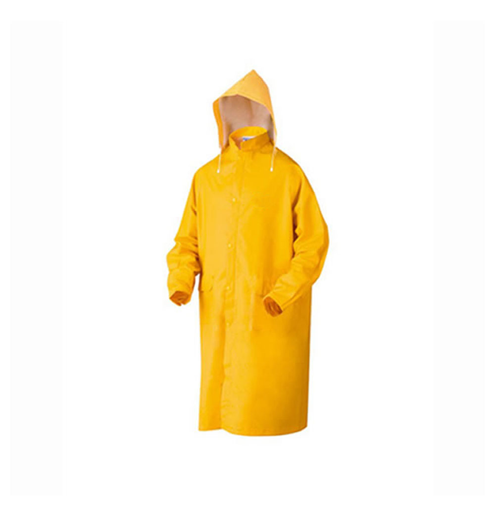

```{r setup, include=FALSE}
knitr::opts_chunk$set(echo = TRUE)
library(dplyr)
library(ggplot2)
# library(readr)
# cbbPalette <- c("#000000", "#E69F00", "#56B4E9", "#009E73", "#F0E442", "#0072B2", "#D55E00", "#CC79A7")
# ggplot <- function(...) ggplot2::ggplot(...) + scale_fill_manual(values=cbbPalette)
# ggplot <- function(...) ggplot2::ggplot(...) + scale_colour_manual(values=cbbPalette)
# ggplot <- function(...) ggplot2::ggplot(...) + scale_fill_gradientn(colors = cbbPalette,)
# library(ggthemes)
scale_colour_discrete <- scale_colour_viridis_d
scale_colour_continuous <- scale_colour_viridis_c
theme_set(theme_bw())
update_geom_defaults("line", list(size = 1.1))
# scale_fill_continuous <- scale_fill_colorblind
```

## Base

Cargue los datos que se le entregaron, con el comando correspondiente.

```{r,message=FALSE,error=FALSE}
load('Datos_SegurosOECD.RData')
```

Para esta clase vamos a ocupar dos librerías:

>- `dplyr`

>- `ggplot2`


## Estructura de estos datos


Vamos a usar el dataframe que se indicó anteriormente, el cual tiene las siguientes columnas:

```{r,eval=FALSE}
str(seguros_OECD)
```

<!-----
```{r,echo=FALSE}
head(seguros_OECD,18000) %>% str
```
---->

## Descripción de las variables


```{r}
names(seguros_OECD)
```


## Primer gráfico

Para describir una variable categórica se puede usar un gráfico de barras, estos le dan una altura correspondiente a la cantidad de observaciones que se observen en cada categoría

\pause

```{r,eval = FALSE,fig.align='center'}
ggplot(data = seguros_OECD) +
  geom_bar(mapping = aes(x = TipoSeguro))
```


## Primer gráfico

```{r,echo = FALSE,fig.align='center'}
ggplot(data = seguros_OECD) +
  geom_bar(mapping = aes(x = TipoSeguro))
```


## Segundo gráfico

Repita el gráfico anterior, pero usando la variable `Moneda`
\pause

```{r,echo = FALSE,fig.align='center'}
ggplot(data = seguros_OECD) +
  geom_bar(mapping = aes(x = Moneda))
```

## Una variable continua

Para describir una variable continua se usan los histogramas, los cuales hacen "cajitas" de cierto ancho, y dependiendo de cuantas observaciones se encuentren en cada cajita se le asigna esa altura.

```{r,fig.align='center',eval=FALSE}
ggplot(data = seguros_OECD) + 
  geom_histogram(mapping = aes(x=PrimasCedidas),na.rm=T)
```

## Una variable continua

```{r,fig.align='center',echo=FALSE}
ggplot(data = seguros_OECD) + 
  geom_histogram(mapping = aes(x=PrimasCedidas),na.rm=T)
```

## Una variable continua, 2

Repita el gráfico anterior, pero usando `PrimasNetas`.<!--- \pause
¿Qué pasa si no pone el parámetro `na.rm = T`?--->

\pause
```{r,fig.align='center',echo=FALSE}
ggplot(data = seguros_OECD) + 
  geom_histogram(mapping = aes(x=PrimasNetas),na.rm = T)
```


## Interacción de variables

Con dos variables continuas:
\pause


```{r,eval=FALSE}
ggplot(data = seguros_OECD,
       mapping = aes(x = PrimasCedidas,y = PrimasNetas)) +
  geom_point(na.rm =TRUE)
```


`geom_point`, ubica las columnas de cada fila de la tabla en el plano cartesiano adónde se ubican las coordenadas $x$ e $y$ que se le indiquen. En este caso, x=PrimasCedidas, y=PrimasNetas.


## Interacción de variables

Con dos variables continuas:

```{r,echo=FALSE,fig.align='center'}
ggplot(data = seguros_OECD,
       mapping = aes(x = PrimasCedidas,y = PrimasNetas)) +
  geom_point(na.rm = TRUE)
```

## Interacción de variables

Repita el gráfico anterior, pero usando `PrimaBruta` y `PrimasCedidas`

\pause

```{r,echo=FALSE,fig.align='center'}
ggplot(data = seguros_OECD,
       mapping = aes(x = PrimaBruta,y = PrimasCedidas)) + 
  # Tambien pueden ser al revés los ejes
  geom_point(na.rm = TRUE)
```


## Preguntas

¿Qué función de `dplyr` usaría para identificar la observación con `PrimaBruta` mayor a 3e8? \pause 


¿Cuántos tienen `PrimasCedidas` mayor a 2e7? \pause


¿Cuántos tienen alguno de los dos anteriores? \pause 

`filter(PrimaBruta > 3e8)` \pause

`filter(PrimasCedidas > 2e7)` \pause

`filter(PrimaBruta > 3e8 | PrimasCedidas > 2e7)` \pause


## Agregar colores 

\pause


## Agregar colores

Si se quieren agregar colores, se agrega en el `aes()` el parámetro `color = <VARIABLE_A_USAR>` (o `colour`):
\pause

```{r,eval = FALSE}
ggplot(data = seguros_OECD) +
  geom_point(mapping = aes(x = PrimaBruta,
                           y = PrimasCedidas,
                           color = TipoSeguro),
             na.rm = TRUE)
```

## Agregar colores
Y queda coloreado... \pause


```{r,echo=FALSE,fig.align='center'}
ggplot(data = seguros_OECD) +
  geom_point(mapping = aes(x = PrimaBruta,
                           y = PrimasCedidas,
                           color = TipoSeguro),na.rm = TRUE)
```


## Ejercicio colores

Repita el gráfico anterior, pero usando `PrimasNetas`, en el eje X, `PrimasCedidas` en el eje Y, y coloreando con la columna `Moneda`.
\pause

```{r,echo=FALSE,fig.align='center'}
ggplot(data = seguros_OECD) +
  geom_point(mapping = aes(x = PrimasNetas,
                           y = PrimasCedidas,
                           color = Moneda),na.rm = TRUE)
```

## Transparencia

\pause


## Transparencia

Muchas veces quedan imágenes como la anterior en la que quedan manchas de colores en la imagen y no se entiende bien\pause, para esto se usa el parámetro `alpha`, para indicar el nivel de transparencia que se quiere en la imagen a usar:

\pause

```{r,eval=FALSE}
ggplot(data = seguros_OECD) +
  geom_point(mapping = aes(x = PrimasNetas,
                           y = PrimasCedidas,
                           color = Moneda),
             alpha = 0.20,
             na.rm = TRUE)
```

Note que `alpha` es un parámetro de la función `geom_point`, no de la función `aes`

## Transparencia

```{r,echo=FALSE,fig.align='center'}
ggplot(data = seguros_OECD) +
  geom_point(mapping = aes(x = PrimasNetas,
                           y = PrimasCedidas,
                           color = Moneda),
             alpha = 0.20,
             na.rm = TRUE)
```

\pause

Con esto se interpreta mejor en _cuales_ lugares están concentradas las primas.

## Tamaño

\pause

\begin{center}
Importa
\end{center}

## Tamaño

Existen bastantes más parámetros que se pueden incluir, entre estos está `size`, que puede definirse como una constante o bien, que dependa de otra variable:

```{r,eval=FALSE}
ggplot(data = seguros_OECD) +
  geom_point(mapping = aes(x = PrimasNetas,
                           y = PrimasCedidas,
                           color = Moneda,size = PrimaBruta),
             alpha = 0.20,
             na.rm = TRUE)
```

## Tamaño

```{r,echo=FALSE,fig.align='center'}
ggplot(data = seguros_OECD) +
  geom_point(mapping = aes(x = PrimasNetas,
                           y = PrimasCedidas,
                           color = Moneda,size = PrimaBruta),
             alpha = 0.20,
             na.rm = TRUE)
```


## Variables continuas vs discretas

Para graficar variables continuas vs las variables discretas se puede usar la función `geom_freqpoly`, que es muy similar a la función del histogram en el sentido de que muestra cual es la distribución de las variables. Solo que es más claro para agrupar en distintos grupos que en el histograma.

```{r,eval=FALSE}
ggplot(data = seguros_OECD) + 
  geom_freqpoly(mapping = aes(x = PrimaBruta,
                              colour = TipoSeguro),
                na.rm = TRUE,bins = 30)
```

## Variables continuas vs discretas

```{r,echo=FALSE,fig.align='center'}
ggplot(data = seguros_OECD) + 
  geom_freqpoly(mapping = aes(x = PrimaBruta,
                              colour = TipoSeguro),
                na.rm = TRUE,bins = 30)
```

\pause

Parece que las primas brutas se distribuyen de forma similar entre distintos seguros. <!---, y que hay una mayoría en los niveles de ingresos medios.--->

## Verlo como porcentaje:
\pause
Para graficarlo como porcentaje se incluye el parámetro `y=..density..`
\pause

```{r,eval=FALSE,fig.align='center'}
ggplot(data = seguros_OECD) + 
  geom_freqpoly(mapping = aes(x = PrimaBruta,
                              colour = TipoSeguro,
                              y = ..density..),
                na.rm = TRUE,bins = 30)
```

El parámetro `bins`, está predefinido como 30, y da un aviso de que vale eso. Por lo que lo ponemos explícito de que vale 30. En cursos avanzados se ven métodos para elegir este parámetro apropiadamente. \pause Si intenta no incluirlo, se indica que se pone como 30.

## Verlo como porcentaje

\pause
```{r,echo=FALSE,fig.align='center'}
ggplot(data = seguros_OECD) + 
  geom_freqpoly(mapping = aes(x = PrimaBruta,
                              colour = TipoSeguro,
                              y = ..density..),
                na.rm = TRUE,bins = 30)
```

\pause Esto nos indica que la prima bruta no depende del tipo de seguro. 


## Ejercicio 

Repita el gráfico anterior, usando `PrimasNetas` agrupando con el tipo moneda \pause ¿Hay mucha diferencia?
\pause

```{r,echo=FALSE,fig.align='center'}
ggplot(data = seguros_OECD) + 
  geom_freqpoly(mapping = aes(x = PrimasNetas,
                              colour = Moneda,
                              y = ..density..),
                na.rm = TRUE,bins = 30)
```

## Otro ejercicio

En el gráfico anterior, ¿qué pasa si pone el parámetro `bins = 20`? ¿Igual a 40? ¿Igual a 2? 

## Dos variables categóricas
\pause

Otro tipo de relación que se puede explorar es entre dos variables categóricas, usando la función `geom_count`, la cual agrupa entre ambas categorías y cuenta la cantidad de obervaciones que hay en cada combinación:
\pause

```{r,eval=FALSE}
ggplot(seguros_OECD) + 
  geom_count(aes(TipoSeguro,Moneda))
```

## Dos variables categóricas


```{r,echo=FALSE,fig.align='center'}
ggplot(seguros_OECD) + 
  geom_count(aes(TipoSeguro,Moneda))
```

## Ejercicio count

Repita el ejercicio anterior, pero revisando la relación entre `Year` y `TipoSeguro`, únicamente en el país `France`.
\pause


```{r,echo=FALSE,fig.align='center'}
seguros_OECD %>% 
  filter(Country =='France') %>% 
  ggplot() + 
  geom_count(aes(Year,TipoSeguro))
```

## Sintaxis general de un `ggplot` 

Todos los gráficos que se hacen en ggplot, siguen la siguiente sintaxis:
\pause

```{r,eval=FALSE}
ggplot(data = <Mis_Datos>) +
  <GEOM_FUNCION>(mapping = aes(<EXPLICACION_VARIABLES_A_USAR>))
```
\pause


Se le pueden agregar más _capas_, como vamos a ver proximamente...


## Lineas

Para mostrar progreso a través del tiempo de alguna variable o algo por el estilo, se pueden usar lineas, con la función `geom_line`:

```{r,eval=FALSE}
library(tidyr)
`%?%` <- function(a,b)ifelse(is.na(a),b,a)
seguros_CA <- seguros_OECD %>% 
  filter(Country %in% c('Costa Rica','El Salvador','Guatemala','Panama')) %>% 
  filter(Moneda == 'US Dollars (millions)') %>% 
  select(-PrimasNetas,-PrimasCedidas) %>% 
  spread(key = TipoSeguro,val = PrimaBruta) %>% 
  filter(Year >= 2010) %>% 
  mutate(Composite = Composite%?%0,Life = Life %?%0,
         `Non-Life` = `Non-Life`%?%0) %>% 
  mutate(Total = Composite + Life + `Non-Life` )
ggplot(data = seguros_CA,
       aes(x = Year,y = Composite,
           color = Country))+geom_line()
```

\pause

¿Qué hace el código anterior?

## Lineas

```{r,echo=FALSE,fig.align='center'}
library(tidyr)
`%?%` <- function(a,b)ifelse(is.na(a),b,a)
seguros_CA <- seguros_OECD %>% 
  filter(Country %in% c('Costa Rica','El Salvador','Guatemala','Panama')) %>% 
  filter(Moneda == 'US Dollars (millions)') %>% 
  select(-PrimasNetas,-PrimasCedidas) %>% 
  spread(key = TipoSeguro,val = PrimaBruta) %>% 
  filter(Year >= 2010) %>% 
  mutate(Composite = Composite%?%0, Life = Life %?%0,
         `Non-Life` = `Non-Life`%?%0) %>% 
  mutate(Total = Composite + Life + `Non-Life`)

ggplot(data = seguros_CA,
       aes(x = Year,y = Composite,
           color = Country)) + 
    geom_line()
```


## Ejercicio lineas

Repita el ejercicio anterior, pero usando `Total` en lugar de `Composite`
\pause

```{r,echo=FALSE,fig.align='center'}
seguros_CA %>%  
  ggplot(mapping = aes(x = Year,y = Total,
                       color = Country)) +
  geom_line()
```


## Capas
\pause



## Capas:
Hasta el momento nos hemos limitado a sumar una capa, pero podemos agregarle más capas, para recalcar ciertos valores:

```{r,eval=FALSE}
seguros_CA %>%  
  ggplot(mapping = aes(x = Year,y = Total,color = Country)) +
  geom_line() + 
  geom_point(size = 2)
```


## Capas:

```{r,echo=FALSE,fig.align='center'}
seguros_CA %>%  
  ggplot(mapping = aes(x = Year,y = Total,color = Country)) +
  geom_line() + 
  geom_point()
```


## Otro tipo de gráfico:

Para comprender mejor la relación entre dos variables continuas, se puede usar la función `geom_bind2d`:

```{r,eval=FALSE}
seguros_OECD %>% 
  ggplot(aes(x =PrimaBruta,y = PrimasNetas)) + 
  geom_bin2d(na.rm = TRUE)
```


## Otro tipo de gráfico:


```{r,echo=FALSE,fig.align='center'}
seguros_OECD %>% 
  ggplot(aes(x =PrimaBruta,y = PrimasNetas)) + 
  geom_bin2d(na.rm = TRUE)
```


## Ejercicio `geom_bin2d`

Esta función recibe un parámetro que se llama `binwidth`, que es un vector que indica cual es el grosor de los `bins` que va a hacer (similar al histograma), para contar. \pause Repita 3 veces el gráfico anterior, e incluya este parámetro usando los siguientes pares:

- `c(2e6,2e6)`

- `c(2e7,2e8)`

- `c(5e6,6e6)`


## Más variables...

\pause 

Para que el análisis descriptivo sea más claro, se pueden incluir más variables a la hora de hacer gráficos. Para esto se puede usar la capa `facet_grid`

```{r,eval=FALSE}
seguros_OECD %>% 
  ggplot(aes(x = PrimaBruta,y = PrimasNetas)) + 
  geom_point(na.rm = TRUE) +
  facet_grid(.~Moneda)
```


## Más variables...


```{r,echo=FALSE,fig.align='center'}
seguros_OECD %>% 
  ggplot(aes(x = PrimasCedidas,y = PrimasNetas)) + 
  geom_point(na.rm = TRUE) +
  facet_grid(.~Moneda)
```

## Ejercicio más variables

Repita el gráfico anterior, pero usando `facet_grid(TipoSeguro~.)`. \pause Repita el gráfico anterior pero usando `facet_grid(TipoSeguro~Moneda)`\pause, y si además colorea con `Country`? Si se ve muy feo, intente usar solo `c('Brazil','Colombia','France','Chile')`


## Ejercicio más variables 

```{r,echo=FALSE,fig.align='center'}
seguros_OECD %>% 
  filter(Country %in% c('Brazil','Colombia','France','Chile')) %>% 
  ggplot(aes(x = PrimasCedidas,y = PrimasNetas)) + 
  geom_point(na.rm = TRUE,aes(color = Country)) +
  facet_grid(TipoSeguro~Moneda)
```


## Objetos

Todos los ggplots son objetos, por lo que no solo se obtiene un gráfico, sino que es fácil de conservar:

```{r}
plot_1 <- ggplot(data = seguros_OECD) + 
  geom_histogram(mapping = aes(PrimaBruta),
                 bins = 30,na.rm = TRUE)
```

\pause
Si llama `plot_1` desde la **consola** se despliega en la pestaña de `Plots`. \pause 


## Graficar agregando capas
\pause

Si quiere realizar modificaciones, usa la misma sintaxis de siempre, agregando capas:

```{r,eval=FALSE}
plot_1 + 
  facet_grid(.~Moneda)
```

Esto se presta para ir desarrollando progresivamente los gráficos, y efectivamente ir explorando las relaciones que se puede presentar


## Graficar agregando capas

```{r,echo=FALSE,fig.align='center'}
plot_1 + 
  facet_grid(.~Moneda)
```

## Box-plots

Una herramienta muy útil para graficar, son los boxplots, que ayudan a entender como están distribuidas las variables y cuales son "raras"

```{r,eval=FALSE}
ggplot(data = seguros_CA) +
  geom_boxplot(mapping = aes(y = Composite,x = Country),
               na.rm = TRUE)
```

## Box-plots

```{r,echo=FALSE,fig.align='center'}
ggplot(data = seguros_CA) +
  geom_boxplot(mapping = aes(y = Composite,x = Country),
               na.rm = TRUE)
```


## Girar coordenadas

Algunas veces, se tienen nombres muy largos para desplegar en el eje X, por lo que se pueden girar las coordenadas, para que se entiendan mejor, y se reciba la misma información:
```{r,eval=FALSE,fig.align='center'}
ggplot(data = seguros_OECD) +
  geom_boxplot(mapping = aes(y = log(PrimasNetas),x = factor(Year)),
               na.rm = TRUE) +
  coord_flip()
```

Además, note que se pueden agregar funciones directamente cuando se llaman las "columnas".

## Girar coordenadas

```{r,echo=FALSE,fig.align='center'}
ggplot(data = seguros_OECD) +
  geom_boxplot(mapping = aes(y = log(PrimasNetas),x = factor(Year)),
               na.rm = TRUE) +
  coord_flip()
```


## Ejercicio

¿Qué pasa si hace el gráfico anterior pero sin `factor`? \pause ¿Y sin `log`? \pause ¿Y si al gráfico original le agrega una separación por tipo de seguro?


## Ejercicio

```{r,echo=FALSE,fig.align='center'}
ggplot(data = seguros_OECD) +
  geom_boxplot(mapping = aes(y = log(PrimasNetas),x = factor(Year)),
               na.rm = TRUE) +
  coord_flip() + 
  facet_grid(.~TipoSeguro)
```


## Titulos y ejes

```{r}
plot_titulo <- ggplot(data = seguros_OECD) + 
    geom_freqpoly(mapping = aes(x = log(PrimaBruta),
                              colour = Moneda,
                              y = ..density..),
                na.rm = TRUE,bins = 30) + 
  ggtitle('Distribución de las log-Primas Brutas',
          subtitle = 'Por tipo de Monedas') +
  xlab('Primas Brutas') +
  ylab('Porcentaje')
```


## Titulos y ejes

```{r,echo=FALSE,fig.align='center'}
plot_titulo
```


## Etiquetas

Bueno, pero también sería bueno poder modificar el nombre del color, y para agregar una pequeña leyenda (caption) se puede usar el parámetro `caption`:
\pause
```{r,eval=FALSE}
plot_titulo +
  labs(color = 'Tipo de Moneda',
       caption = 
         'Fuente: https://www.oecd-ilibrary.org/,\n Creacion propia')
```

## Etiquetas

```{r,echo=FALSE,fig.align='center'}
plot_titulo +
  labs(color = 'Tipo de Moneda',
       caption = 'Fuente: https://www.oecd-ilibrary.org/,\n Creacion propia')
```

## labs

Si se quiere, se pueden incluir todos los parámetros en la capa de `labs`:


```{r,eval=FALSE}
seguros_CA %>% 
  mutate(Porc_Comp = Composite/Total) %>% 
  ggplot(mapping = aes(x = Year,y = Porc_Comp,
                       color = Country)) +
  geom_line() + 
  geom_point() + 
  labs(title = 'Histórico del porcentaje de seguros compuestos',
       subtitle = 'Por país',
       x = 'Año',
       y = 'Porcentaje',
       color = 'País')
```


## labs

```{r,echo=FALSE,fig.align='center'}
seguros_CA %>% 
  mutate(Porc_Comp = Composite/Total) %>% 
  ggplot(mapping = aes(x = Year,y = Porc_Comp,
                       color = Country)) +
  geom_line() + 
  geom_point(size = 2) + 
  labs(title = 'Histórico del porcentaje de seguros compuestos',
       subtitle = 'Por país',
       x = 'Año',
       y = 'Porcentaje',
       color = 'País')
```


## theme

Hay varios temas que se pueden aplicar a los gráficos, para cambiar varios parámetros predefinidos. Este se agrega como una capa más. Están:

>- `theme_bw()`
>- `theme_classic()`
>- `theme_dark()`
>- `theme_get()`
>- `theme_gray()`
>- `theme_light()`
>- `theme_linedraw()`
>- `theme_minimal()`

Y hay paquetes para incluir aún más temas... \pause (Ver `ggthemes`)


## Escala

\pause

{width=80%}


## Escala
\pause
Muchas veces se quieren modificar los parámetros que se tienen predefinidos. Es por esto que se define la capa de escalas, para poder cambiar a gusto del usuario/programador/analista estos valores predefinidos.

\pause
```{r}
plot_2 <- ggplot(data = seguros_OECD) +
  geom_bar(mapping = aes(x = Year,fill=Moneda))
```

¿Cómo se ve el gráfico anterior? \pause Para cambiar los colores que se usan, e incluso las viñetas asociadas a los colores, se usa `scale_fill_manual`

```{r,eval=FALSE}
plot_2 + 
  scale_fill_manual(values = c('yellow','blue','black'))
```

## Escala

```{r,echo=FALSE,fig.align='center'}
plot_2 + 
  scale_fill_manual(values = c('yellow','blue','black'))
```


## Escala, etiquetas

Si además se le quieren cambiar las etiquetas que se usan, en lugar de los valores que vienen en los datos. Se puede usar el parámetro \pause `labels`, en el mismo orden que se usa para `values`.


```{r,eval=FALSE}
plot_2 + 
  scale_fill_manual(values = c('yellow','blue','black'),
                    labels = c('Euroooos','Dólares','Moneda Nacional'))
```

## Escala, etiquetas plot

```{r,echo=FALSE,fig.align='center'}
plot_2 + 
  scale_fill_manual(values = c('yellow','blue','black'),
                    labels = c('Euroooos','Dólares','Moneda Nacional'))
```


## Escalas, aún más!

Algunas veces es informativo cambiar la escala de alguno de los ejes. Por ejemplo, pasarlo a base logarítmica, raíz cuadrada, revertirlo, entre otras... Por ejemplo:\pause

```{r,eval=FALSE}
plot_2 + 
  scale_fill_manual(values = c('yellow','blue','black'),
                    labels = c('Euroooos','Dólares','Moneda Nacional')) +
  scale_y_log10() +
  scale_x_reverse()
```


## Escalas, aún más, gráfico:

\pause

```{r,echo=FALSE,fig.align='center'}
plot_2 + 
  scale_fill_manual(values = c('yellow','blue','black'),
                    labels = c('Euroooos','Dólares','Moneda Nacional')) +
  scale_y_log10() +
  scale_x_reverse()
```

## Ejercicio

Repita el gráfico anterior, quitando cada capa al menos una vez, note las diferencias. \pause Repita uno de los gráficos anteriores y cambie el `scale_y_log10` por `scale_y_sqrt`.

\pause

Regrese al gráfico en que se hace el `geom_bin2d`, y agregue una capa usando: `scale_fill_distiller`. Esta función recibe varios parámetros, la idea es que utilice el parámetro `palette` y use alguno de las siguientes strings como valor: `'Spectral','Set1','Set2','Set3','Greens'`. \pause ¿Qué pasa si además incluye el parámetro `direction = -1`? ¿Y si pone `direction = -7`?


## Ejercicio fill

```{r,echo = FALSE,fig.align='center',warning=FALSE}
seguros_OECD %>% 
    ggplot(aes(x =PrimaBruta,y = PrimasNetas)) + 
    geom_bin2d(na.rm = TRUE) + 
    scale_fill_distiller(palette = 'Spectral',direction = -1) + 
  scale_x_log10() + 
  scale_y_log10()
```

## Más escalas...

Existen escalas para un montón de parámetros más. Por ejemplo, el tipo de linea (`scale_linetype`), la transparencia (`scale_alpha`), el tamaño `scale_size`, la forma (este es un parámetro de `geom_point`) usando  `scale_shape`. 

Y hay otro montón de formas de manipular las escalas...


## Estadísticas
\pause
Algunas veces se quieren agregar funciones para realizar una comparación entre los datos con una función particular. 

Por ejemplo, si queremos comparar los montos totales de Costa Rica, con la función lineal `f(x) = a*x+b`, con `a = 235.6627` y `b = -472189.2`. Definimos la función anterior.
\pause

```{r}
linea_CR <- function(x){-472189.2 + 235.6627*x}
```

\pause
Para evaluarlo, usamos:

```{r}
plot_3 <- seguros_CA %>%
  filter(Country == 'Costa Rica') %>% 
  ggplot(mapping = aes(x = Year,y = Total)) +
  geom_line(size = 1.5,color = 'lightgoldenrod3') + 
  geom_point(size = 1.7,color= 'orangered') + 
  stat_function(fun = linea_CR,color = 'royalblue4',size = 1.1)
```

## Estadísticas


```{r,echo=FALSE,fig.align='center'}
plot_3
```

## Ejercicio 
Repita el gráfico anterior, pero usando una cuadrática `g(x) = a*x^2 + b*x + c`, con `c = -59908139, b = 59287.83,a = -14.667 7`. ¿cuál gráfico se ve como una "mejor aproximación"?

\pause

## Ejercicio Solucion

```{r,eval=FALSE}
CoefC = -59908139
CoefB = 59287.83
CoefA = -14.6677
curva_CR <- function(x,a,b,c){a*x^2 + b*x + c}
seguros_CA %>%
  filter(Country == 'Costa Rica') %>% 
  ggplot(mapping = aes(x = Year,y = Total)) +
  geom_line(size = 1.5,color = 'lightgoldenrod2') + 
  geom_point(size = 1.7,color= 'orangered') + 
  stat_function(fun = curva_CR,
                color = 'royalblue4',size = 1.1,
                args = list(a=CoefA,b=CoefB,c=CoefC))
```


## Ejercicio

```{r,echo=FALSE,fig.align='center',fig.height=4}
CoefC = -59908139
CoefB = 59287.83
CoefA = -14.6677
curva_CR <- function(x,a,b,c){a*x^2 + b*x + c}
seguros_CA %>%
  filter(Country == 'Costa Rica') %>% 
  ggplot(mapping = aes(x = Year,y = Total)) +
  geom_line(size = 1.5,color = 'lightgoldenrod2') + 
  geom_point(size = 1.7,color= 'orangered') + 
  stat_function(fun = curva_CR,
                color = 'royalblue4',size = 1.1,
                args = list(a=CoefA,b=CoefB,c=CoefC))
```


## `stat_unique`

Esta función lo que hace es que elimina los valores repetidos del gráfico:

```{r,eval=FALSE}
seguros_OECD %>% 
  ggplot(aes(y=Country,x = Year)) + 
  geom_point() + 
  stat_unique()
```


## `stat_unique`, gráfico

```{r,echo=FALSE,fig.align='center'}
seguros_OECD %>% 
  ggplot(aes(y=Country,x = Year)) + 
  geom_point() + 
  stat_unique()
```


## Coordenadas 

Como en un mapa. \pause

La mayoría de gráficos que se hacen (como los de puntos), tienen coordenadas en sus ejes `(X, Y)`. Esta capa se encarga de modificar el comportamiento predefinido. Funciona para hacer _zoom_ a una parte del gráfico, o alejarse de una sección, modificar perspectivas, o realizar transformaciones.


## `zoom`
\pause

Esto se hace usando la capa `coord_cartesian`, la cual tiene 2 parámetros: `xlim` y `ylim`. Estos toman un vector con dos entradas, las cuales indican en qué sección del gráfico original se van a concentrar.

```{r}
plot_5 <- seguros_OECD %>% 
  ggplot(aes(x = PrimaBruta,fill = Moneda)) + 
  geom_histogram(na.rm = TRUE)
```

¿Cómo se ve este gráfico? \pause Para hacerle _zoom_ al área entre $9e6$ y $7e7$, hacemos:

```{r,eval=FALSE}
plot_5 + 
  coord_cartesian(xlim = c(9e6,7e7))
```

## zoom
```{r,echo=FALSE,fig.align='center'}
plot_5 + 
  coord_cartesian(xlim = c(9e6,7e7))
```
## zoom

El gráfico anterior aún no se ve bien. Pues falta hacerle zoom también al eje y, por lo que hacemos:

```{r,eval=FALSE}
plot_5 + 
  coord_cartesian(xlim = c(9e6,7e7),ylim = c(0,50))
```


## zoom

```{r,echo=FALSE,fig.align='center'}
plot_5 + 
  coord_cartesian(xlim = c(9e6,7e7),ylim = c(0,50))
```


## Proporcional

Esta capa recibe el parámetro `ratio`, el cual se encarga de indicar cuanto vale el tamaño a mostrar de: _eje y_ sobre el _eje x_.

```{r,eval=FALSE}
plot_5 + 
    coord_fixed(ratio = 10000)
```

## Proporcional

```{r,echo=FALSE,fig.align='center'}
plot_5 + 
    coord_fixed(ratio = 10000)
```

## Ejercicios proporcional

Repita el gráfico anterior usando `ratio = 70000`, luego `ratio = 100000`, y `ratio = 1`.

## `coord_polar`

Sirve para hacer gráficos de porcentajes. Los cuales pocas veces son recomendados, pues los humanos somos malos distinguiendo ángulos. Muchas veces es mejor usar un gráfico de barras sencillo:

```{r,eval=FALSE}
df <- data.frame(
  variable = c("Ganas de estar en clase en amarillo", 
               "Ganas de estar en clase"),
  value = c(47.19, 53.81)
)


ggplot(df, aes(x = "", y = value, fill = variable)) +
  geom_col(width = 1) +
  scale_fill_manual(values = c("lightblue","gold")) +
  coord_polar("y", start = pi / 3)
```

## `coord_polar`, gráfico

```{r,echo=FALSE,fig.align='center'}
df <- data.frame(
  variable = c("Ganas de estar en clase en amarillo", 
               "Ganas de estar en clase"),
  value = c(47.19, 53.81)
)


ggplot(df, aes(x = "", y = value, fill = variable)) +
  geom_col(width = 1) +
  scale_fill_manual(values = c("lightblue","gold")) +
  coord_polar("y", start = pi / 3)
```


## Ejercicio de `coord_polar`

Repita el gráfico anterior, pero quite la capa de `coord_polar`.\pause ¿cuál gráfico entiende mejor?
\pause

Haga un gráfico similar al anterior, pero usando 3 grupos distintos.
\pause

Haga un pac-man


## `geom_text`

También se pueden agregar las etiquetas sobre el gráfico, usando `geom_text`:

```{r,eval=FALSE}
ggplot(df, aes(x = "", y = value, fill = variable,label = variable)) +
  geom_col(width = 1) +
  scale_fill_manual(values = c("lightblue","gold")) + 
  geom_text(position = position_stack(vjust = 0.5))
```


## `geom_text`

```{r,echo=FALSE,fig.align='center'}
ggplot(df, aes(x = "", y = value, fill = variable,label = variable)) +
  geom_col(width = 1) +
  scale_fill_manual(values = c("lightblue","gold")) + 
  geom_text(position = position_stack(vjust = 0.5))
```


## Ejercicio text:

Repita el gráfico anterior, pero sin incluir `position = position_stack(vjust = 0.5)`. \pause Qué pasa ahora si lo corre sin usar `geom_col` ni `scale_fill_manual` ? 

```{r,echo=FALSE,fig.align='center'}
ggplot(df, aes(x = "", y = value,label = variable)) +
  geom_text()
```


## `coord_polar` 

Si se quieren "comparar" tamaños de grupos, usando este tipo de gráficos, se puede hacer:


```{r,eval=FALSE}
seguros_OECD %>% 
  ggplot(aes(x = Nivel_ingresos)) + 
  geom_bar(width = 1,colour = 'red',fill = 'orange') + 
  coord_polar()
```


## Gráfico

```{r,echo=FALSE,fig.align='center'}
seguros_OECD %>% 
  ggplot(aes(x = TipoSeguro)) + 
  geom_bar(width = 1,colour = 'skyblue3',fill = 'orange') + 
  coord_polar()
```

## Tipos de capas:

En general hay 5 capas generales para generar un gráfico usando `ggplot2`
\pause

>- `geom_*`, que indica la forma en que se van a graficar los datos 

>-- ¿cuales hemos visto?

>- `stat_*`, que realiza una transformación (resumen) en los datos y lo grafica

>- `scale_*_**`, sirva para cambiar algún parámetro predefinidio

>- `coord_*`, cambia el tipo/tamaño de las coordenadas que se usan

>- `facet_*`, puede ser `grid` o `wrap`

## Ejercicios

\pause

En los gráficos que usan `geom_line`, explore usar los parámetros `linetype` y `size`.

\pause
En los gráficos de `geom_bar`, explore usando el parámetro `fill` dentro de `aes` . ¿Qué pasa si pone `position='dodge'` como parámetro dentro de un `geom_bar`?

\pause
Juegue con los temas y los gráficos que ha hecho. Use al menos una vez cada tema. ¿Cuál le gusta más?

\pause
Lea sobre `ggsave`, usando la ayuda que se provee en R


## Más colores?

Ver dataframe `luv_colours` 

```{r,echo=FALSE,fig.align='center'}
ggplot(luv_colours, aes(u, v)) +
  geom_point(aes(colour = col), size = 3) +
  scale_color_identity() +
  coord_equal()
```

## Más información sobre ggplot2

[Sitio de referencia de ggplot2](http://ggplot2.tidyverse.org/reference/index.html)

## Próximamente:

optimización