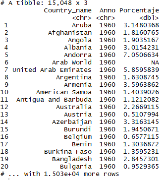
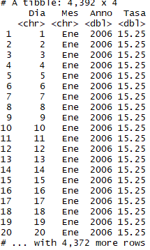
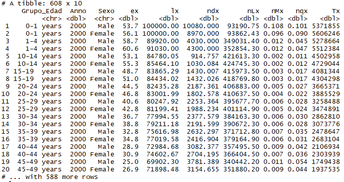

```{r setup, include=FALSE}
knitr::opts_chunk$set(echo = TRUE)
library(tidyr)
library(dplyr)
```

Para esta clase se le han entregado 3 sets de datos: 

- Population_growth.csv

- Life_tables_worlds.csv

- Tasa_Basica_pasiva.xlsx

La idea es que los pase a la forma que se le indica en su ejercicio correspondiente. Usando los comandos que aprendió en la clase pasada del paquete `tidyr`. Recuerde que este se carga usando el comando `library(tidyr)`

## Ejercicio 1

Los datos de `Population_growth` indican qué porcentaje han crecido las poblaciones en los últimos años en varios países. Cargue los datos de `Population_growth` y reacomódelos para que se vean como la siguiente imagen:





## Ejercicio 2

Los datos de `Tasa_Basica_pasiva`, indican la tasa básica pasiva diaria que se experimentó en Costa Rica en los últimos años, según el Banco Central de Costa Rica. Reacomódelos para que tomen la siguiente forma:



__Sugerencia:__ la función `sub` sirve para cambiar substrings por otros substrings. Puede usarla con mutate, para cambiar comas por puntos, para transformar en números.

## Ejercicio 3

Una herramienta que se usa mucho en cursos de matemática actuarial, son las tablas de vida. Esta tabla se obtuvo de la página de la organización mundial de la salud (WHO, por sus siglas en inglés). La idea es que apoyándose en las funciones de `tidyr` y `dplyr`, consiga reorganizarla para que tome la siguiente forma:




